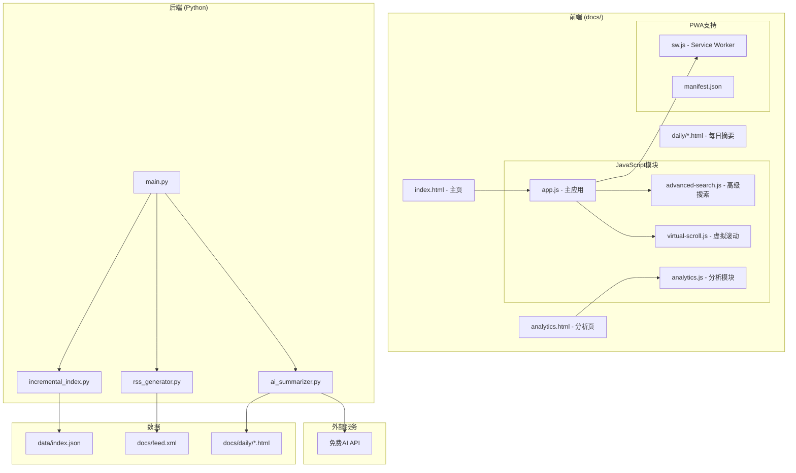

# Design Document: Literature Advanced Features

## Overview

本设计文档描述文献追踪系统的高级功能实现方案，包括数据分析与可视化、高级搜索、性能优化、RSS输出和AI摘要报告。

技术栈：
- 前端：HTML5, CSS3, Vanilla JavaScript, Chart.js, wordcloud2.js
- 后端：Python 3
- AI API：Gemini / SiliconFlow / Groq / DeepSeek（免费模型）
- PWA：Service Worker, manifest.json

## Architecture



## Components and Interfaces

### 1. Analytics Dashboard (前端)

独立的数据分析页面，展示各种统计图表。

```javascript
// analytics.js

// 统计数据结构
interface AnalyticsData {
    totalArticles: number;
    aiRelatedCount: number;
    nonAiCount: number;
    journalDistribution: Map<string, number>;
    monthlyTrend: Array<{month: string, total: number, ai: number, nonAi: number}>;
    weeklyTrend: Array<{week: string, total: number, ai: number, nonAi: number}>;
    keywords: Array<{word: string, count: number}>;
    aiGrowthRate: number;
}

// 计算统计数据
function calculateAnalytics(articles: Article[]): AnalyticsData

// 渲染趋势图表
function renderTrendChart(data: AnalyticsData, mode: 'monthly' | 'weekly'): void

// 渲染期刊分布饼图
function renderJournalPieChart(data: AnalyticsData): void

// 渲染关键词云
function renderWordCloud(keywords: Array<{word: string, count: number}>): void

// 导出CSV
function exportToCSV(data: AnalyticsData): void

// 导出图表为PNG
function exportChartToPNG(chartId: string): void
```

### 2. Keyword Extractor (前端)

从文献中提取关键词，过滤停用词。

```javascript
// 停用词列表
const STOP_WORDS = new Set([
    'the', 'a', 'an', 'and', 'or', 'but', 'in', 'on', 'at', 'to', 'for',
    'of', 'with', 'by', 'from', 'as', 'is', 'was', 'are', 'were', 'been',
    'be', 'have', 'has', 'had', 'do', 'does', 'did', 'will', 'would',
    'could', 'should', 'may', 'might', 'must', 'shall', 'can', 'need',
    'this', 'that', 'these', 'those', 'it', 'its', 'we', 'our', 'they',
    'their', 'which', 'what', 'who', 'whom', 'where', 'when', 'why', 'how',
    'all', 'each', 'every', 'both', 'few', 'more', 'most', 'other', 'some',
    'such', 'no', 'nor', 'not', 'only', 'own', 'same', 'so', 'than', 'too',
    'very', 'just', 'also', 'now', 'here', 'there', 'then', 'once', 'using'
]);

// 提取关键词
function extractKeywords(articles: Article[], maxCount: number = 50): Array<{word: string, count: number}>

// 分词和清理
function tokenize(text: string): string[]

// 计算词频
function countWordFrequency(words: string[]): Map<string, number>
```

### 3. Advanced Search Engine (前端)

支持正则表达式和布尔运算符的高级搜索。

```javascript
// advanced-search.js

// 搜索模式
type SearchMode = 'normal' | 'regex' | 'boolean';

// 布尔表达式节点
interface BooleanNode {
    type: 'AND' | 'OR' | 'NOT' | 'TERM';
    value?: string;
    children?: BooleanNode[];
}

// 解析布尔表达式
function parseBooleanQuery(query: string): BooleanNode

// 执行布尔搜索
function executeBooleanSearch(articles: Article[], ast: BooleanNode): Article[]

// 执行正则搜索
function executeRegexSearch(articles: Article[], pattern: string): Article[]

// 验证正则表达式
function validateRegex(pattern: string): {valid: boolean, error?: string}

// 高亮搜索结果
function highlightSearchResults(text: string, query: string, mode: SearchMode): string
```

### 4. Virtual Scroll (前端)

虚拟滚动实现，只渲染可见区域的内容。

```javascript
// virtual-scroll.js

interface VirtualScrollConfig {
    containerSelector: string;
    itemHeight: number;
    bufferSize: number;  // 预加载的屏幕数
    renderItem: (item: any, index: number) => string;
}

class VirtualScroll {
    constructor(config: VirtualScrollConfig);
    
    // 设置数据
    setData(items: any[]): void;
    
    // 滚动到指定位置
    scrollToIndex(index: number): void;
    
    // 更新可见区域
    updateVisibleItems(): void;
    
    // 获取当前可见范围
    getVisibleRange(): {start: number, end: number};
    
    // 销毁实例
    destroy(): void;
}
```

### 5. PWA Service Worker (前端)

实现离线缓存和更新策略。

```javascript
// sw.js

const CACHE_NAME = 'literature-tracker-v1';
const STATIC_ASSETS = [
    '/',
    '/index.html',
    '/analytics.html',
    '/style.css',
    '/app.js',
    '/analytics.js',
    '/manifest.json'
];

// 安装事件 - 缓存静态资源
self.addEventListener('install', (event) => {...});

// 激活事件 - 清理旧缓存
self.addEventListener('activate', (event) => {...});

// 请求拦截 - 缓存优先策略
self.addEventListener('fetch', (event) => {...});

// 后台同步 - 更新数据
self.addEventListener('sync', (event) => {...});
```

### 6. RSS Generator (后端)

生成标准RSS 2.0 feed。

```python
# rss_generator.py

class RSSGenerator:
    def __init__(self, site_url: str, title: str, description: str):
        """初始化RSS生成器"""
        
    def generate_feed(self, articles: list, max_items: int = 100) -> str:
        """生成RSS XML内容"""
        
    def save_feed(self, filepath: str) -> bool:
        """保存RSS文件"""
        
    def create_item(self, article: dict) -> str:
        """创建单个RSS条目"""
```

### 7. AI Summarizer (后端)

使用免费AI API生成每日摘要。

```python
# ai_summarizer.py

class AISummarizer:
    def __init__(self, api_provider: str, api_key: str):
        """
        初始化AI摘要生成器
        api_provider: 'gemini' | 'siliconflow' | 'groq' | 'deepseek' | 'openrouter'
        """
        
    def generate_daily_summary(self, articles: list, date: str) -> dict:
        """
        生成每日摘要
        返回: {
            'overview': str,           # 总览
            'highlights': list,        # 重点文献
            'trends': str,             # 趋势分析
            'article_summaries': list  # 每篇文献摘要
        }
        """
        
    def _call_api(self, prompt: str) -> str:
        """调用AI API"""
        
    def _build_prompt(self, articles: list) -> str:
        """构建提示词"""
        
    def save_summary_html(self, summary: dict, date: str, output_dir: str) -> str:
        """保存摘要为HTML文件"""
        
    def fallback_summary(self, articles: list) -> dict:
        """API失败时的降级摘要"""
```

### 8. Incremental Index (后端)

增量更新索引，只处理新增文献。

```python
# incremental_index.py

class IncrementalIndex:
    def __init__(self, index_path: str):
        """初始化增量索引"""
        
    def get_last_update_time(self) -> datetime:
        """获取上次更新时间"""
        
    def filter_new_articles(self, articles: list) -> list:
        """过滤出新文献"""
        
    def merge_articles(self, existing: list, new: list) -> list:
        """合并新旧文献"""
        
    def update_index(self, new_articles: list) -> dict:
        """
        更新索引
        返回: {'added': int, 'updated': int, 'skipped': int}
        """
```

## Data Models

### Analytics Data Model

```json
{
    "totalArticles": 1000,
    "aiRelatedCount": 350,
    "nonAiCount": 650,
    "journalDistribution": {
        "Nature": 50,
        "Science": 45,
        "Physical Review Letters": 80,
        ...
    },
    "monthlyTrend": [
        {"month": "2024-01", "total": 100, "ai": 35, "nonAi": 65},
        {"month": "2024-02", "total": 120, "ai": 45, "nonAi": 75},
        ...
    ],
    "keywords": [
        {"word": "ferroelectric", "count": 150},
        {"word": "machine learning", "count": 120},
        ...
    ]
}
```

### Boolean Query AST

```json
{
    "type": "AND",
    "children": [
        {"type": "TERM", "value": "machine learning"},
        {
            "type": "OR",
            "children": [
                {"type": "TERM", "value": "ferroelectric"},
                {"type": "TERM", "value": "magnetic"}
            ]
        },
        {
            "type": "NOT",
            "children": [
                {"type": "TERM", "value": "review"}
            ]
        }
    ]
}
```

### Daily Summary Model

```json
{
    "date": "2024-12-28",
    "overview": {
        "total": 25,
        "aiRelated": 10,
        "nonAi": 15,
        "topJournals": ["Nature", "Science", "PRL"]
    },
    "highlights": [
        {
            "title": "...",
            "title_zh": "...",
            "journal": "Nature",
            "link": "https://...",
            "summary": "一句话核心要点"
        }
    ],
    "trends": "今日研究热点集中在...",
    "articlesByJournal": {
        "Nature": [...],
        "Science": [...]
    }
}
```

## Correctness Properties

*A property is a characteristic or behavior that should hold true across all valid executions of a system.*

### Property 1: Monthly Statistics Correctness

*For any* set of articles with valid pub_date, the sum of all monthly counts should equal the total article count, and each article should be counted in exactly one month.

**Validates: Requirements 2.1, 2.4**

### Property 2: Journal Distribution Completeness

*For any* set of articles, the sum of all journal counts (including "Other") should equal the total article count.

**Validates: Requirements 3.1, 3.2, 3.5**

### Property 3: Keyword Extraction Purity

*For any* extracted keyword list, no keyword should be in the STOP_WORDS set, and all keywords should be non-empty strings.

**Validates: Requirements 4.1, 4.3**

### Property 4: Boolean AND Correctness

*For any* two search terms A and B, the result of "A AND B" should be the intersection of results for A alone and B alone.

**Validates: Requirements 7.1**

### Property 5: Boolean OR Correctness

*For any* two search terms A and B, the result of "A OR B" should be the union of results for A alone and B alone.

**Validates: Requirements 7.2**

### Property 6: Boolean NOT Correctness

*For any* search term A, the result of "NOT A" should be the complement of results for A (all articles minus A results).

**Validates: Requirements 7.3**

### Property 7: Regex Search Validity

*For any* valid regex pattern, the search should return only articles where the pattern matches in title, abstract, or other searchable fields.

**Validates: Requirements 6.2, 6.4**

### Property 8: Virtual Scroll Bounds

*For any* scroll position, the rendered items should be within the valid index range [0, totalItems-1], and the visible count should not exceed viewport capacity plus buffer.

**Validates: Requirements 8.1, 8.2, 8.5**

### Property 9: RSS Feed Validity

*For any* generated RSS feed, it should be valid XML and contain at most the specified max_items, with each item having required fields (title, link, pubDate).

**Validates: Requirements 11.1, 11.2, 11.3**

### Property 10: Incremental Index Consistency

*For any* incremental update, the resulting index should contain all previous articles plus new articles, with no duplicates (by ID).

**Validates: Requirements 10.2, 10.3, 10.4**

### Property 11: AI Summary Link Completeness

*For any* AI-generated summary, every mentioned article should have a valid, clickable link to the original source.

**Validates: Requirements 12.5**

## Error Handling

### Frontend Errors

1. **图表渲染失败**
   - 显示错误提示
   - 提供重试按钮
   - 降级为表格显示

2. **正则表达式无效**
   - 显示具体错误信息
   - 高亮错误位置
   - 提供语法帮助

3. **布尔表达式解析失败**
   - 显示解析错误
   - 提供正确语法示例

4. **Service Worker注册失败**
   - 降级为普通网页模式
   - 在控制台记录错误

### Backend Errors

1. **AI API调用失败**
   - 重试3次
   - 降级为简单统计摘要
   - 记录错误日志

2. **RSS生成失败**
   - 保留上一版本的feed.xml
   - 记录错误日志

3. **增量索引冲突**
   - 使用最新数据覆盖
   - 记录冲突详情

## Testing Strategy

### Unit Tests

1. **统计计算测试**
   - 测试月度/周度统计
   - 测试期刊分布计算
   - 测试关键词提取

2. **搜索功能测试**
   - 测试正则表达式匹配
   - 测试布尔运算符
   - 测试边界情况

3. **虚拟滚动测试**
   - 测试可见范围计算
   - 测试滚动位置

### Property-Based Tests

使用 fast-check 进行属性测试，每个测试运行至少100次迭代：

1. **Property 1-3**: 统计正确性测试
2. **Property 4-6**: 布尔搜索测试
3. **Property 7**: 正则搜索测试
4. **Property 8**: 虚拟滚动测试
5. **Property 9-10**: 后端功能测试

### Integration Tests

1. **端到端测试**
   - 测试完整的数据流
   - 测试页面导航
   - 测试离线功能

## Performance Considerations

1. **虚拟滚动**
   - 只渲染可见区域 + 缓冲区
   - 使用 requestAnimationFrame 优化滚动
   - 复用DOM元素

2. **关键词提取**
   - 使用 Web Worker 在后台处理
   - 缓存计算结果

3. **图表渲染**
   - 延迟加载图表库
   - 使用 Canvas 而非 SVG（大数据量时）

4. **PWA缓存**
   - 静态资源使用 Cache First
   - 数据使用 Network First with Cache Fallback

