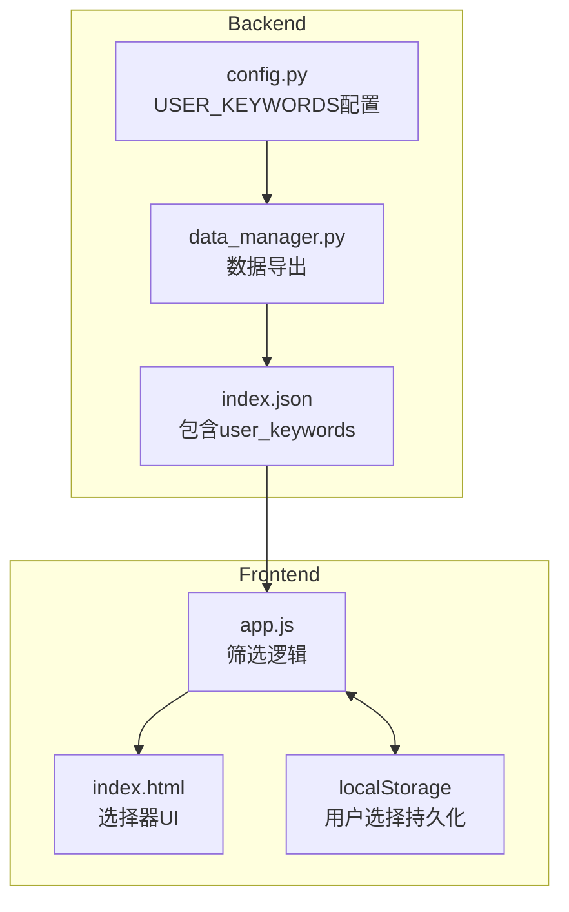

# Design Document: Multi-User Keywords Filter

## Overview

本设计实现多用户关键词筛选功能，允许不同研究人员定义各自的关键词列表，并在网页界面上选择按特定用户的关键词筛选文献。系统采用配置驱动的方式，新增用户只需修改配置文件，无需更改代码。

## Architecture



## Components and Interfaces

### 1. 配置模块 (config.py)

新增 `USER_KEYWORDS` 配置字典，保留原有 `KEYWORDS` 列表以保持向后兼容。

```python
# 多用户关键词配置
USER_KEYWORDS = {
    "于宏宇": [
        "ferro",
        "machine",
        "learn",
        "magne",
        "neural",
        "network",
        "potential",
        "hamiltonian",
    ],
    "朱海燕": [
        "twist",
        "magne",
        "moire",
        "multiferroics",
        "magnetoelectric coupling",
        "CrSBr",
        "altermagnet",
        "ferro",
        "CrTe",
        "magnetic nanotube",
        "topological curvature",
        "curvature-driven",
    ],
}

# 保留原有KEYWORDS以保持向后兼容
KEYWORDS = USER_KEYWORDS.get("于宏宇", [])
```

### 2. 数据管理模块 (data_manager.py)

修改 `generate_index` 函数，将 `USER_KEYWORDS` 导出到 `index.json`。

```python
def generate_index():
    # ... existing code ...
    
    index_data = {
        "total": len(articles),
        "last_update": datetime.now().isoformat(),
        "articles": articles,
        "user_keywords": config.USER_KEYWORDS  # 新增
    }
    
    # ... save to file ...
```

### 3. 前端筛选模块 (app.js)

#### 3.1 全局状态

```javascript
let userKeywords = {};           // 用户关键词配置
let currentKeywordUser = 'all';  // 当前选中的用户
const KEYWORD_USER_STORAGE_KEY = 'literature_keyword_user';
```

#### 3.2 关键词筛选函数

```javascript
function filterByUserKeywords(articles, userName) {
    if (userName === 'all' || !userKeywords[userName]) {
        return articles;
    }
    
    const keywords = userKeywords[userName];
    return articles.filter(article => {
        const searchText = [
            article.title || '',
            article.title_zh || '',
            article.abstract || '',
            article.abstract_zh || ''
        ].join(' ').toLowerCase();
        
        return keywords.some(keyword => 
            searchText.includes(keyword.toLowerCase())
        );
    });
}
```

#### 3.3 关键词高亮函数

```javascript
function highlightUserKeywords(text) {
    if (!text || currentKeywordUser === 'all') {
        return escapeHtmlPreservingLatex(text);
    }
    
    const keywords = userKeywords[currentKeywordUser] || [];
    if (keywords.length === 0) {
        return escapeHtmlPreservingLatex(text);
    }
    
    const escaped = escapeHtmlPreservingLatex(text);
    const pattern = new RegExp(
        `(${keywords.map(k => escapeRegex(k)).join('|')})`, 
        'gi'
    );
    return escaped.replace(pattern, '<span class="keyword-highlight">$1</span>');
}
```

### 4. 前端UI组件 (index.html)

在筛选区域添加用户关键词选择器：

```html
<div class="filter-group">
    <label for="keywordUserFilter">关键词筛选</label>
    <select id="keywordUserFilter" onchange="setKeywordUser(this.value)">
        <option value="all">全部文献</option>
        <!-- 动态填充用户选项 -->
    </select>
</div>
```

## Data Models

### index.json 结构

```json
{
    "total": 1234,
    "last_update": "2025-12-29T10:00:00",
    "articles": [...],
    "user_keywords": {
        "于宏宇": ["ferro", "machine", "learn", ...],
        "朱海燕": ["twist", "magne", "moire", ...]
    }
}
```

### localStorage 存储

```javascript
// Key: literature_keyword_user
// Value: "于宏宇" | "朱海燕" | "all"
```

## Correctness Properties

*A property is a characteristic or behavior that should hold true across all valid executions of a system—essentially, a formal statement about what the system should do. Properties serve as the bridge between human-readable specifications and machine-verifiable correctness guarantees.*

### Property 1: User Keywords Configuration Parsing

*For any* valid USER_KEYWORDS configuration with N users, the exported index.json SHALL contain exactly N user entries with their complete keyword lists preserved.

**Validates: Requirements 1.1, 1.2, 6.1, 6.2, 6.3**

### Property 2: Keyword Filtering Correctness

*For any* article and any user's keyword list, if the article is included in the filtered results, then at least one keyword from that list must appear (case-insensitively) in the article's title, title_zh, abstract, or abstract_zh fields.

**Validates: Requirements 2.1, 2.2, 2.4, 2.5**

### Property 3: Case-Insensitive Partial Matching

*For any* keyword K and any article text T, if K appears as a substring of T (ignoring case), then the article SHALL be matched. Conversely, if K does not appear as a substring of T (ignoring case), the article SHALL NOT be matched by that keyword.

**Validates: Requirements 1.4**

### Property 4: Keyword Selector Display Format

*For any* user in the USER_KEYWORDS configuration, the dropdown option SHALL display the user name followed by the keyword count in the format "{userName} ({count}个关键词)".

**Validates: Requirements 3.4**

### Property 5: Selection Persistence Round-Trip

*For any* valid user selection, saving to localStorage and then loading SHALL return the same user selection.

**Validates: Requirements 3.5**

### Property 6: Keyword Highlighting Consistency

*For any* article text and active user keyword filter, all occurrences of keywords from the selected user's list SHALL be wrapped in highlight spans, and no other text SHALL be wrapped.

**Validates: Requirements 4.1, 4.2**

### Property 7: Filtered Count Accuracy

*For any* combination of active filters (keyword user, date range, journal, favorites, read status), the displayed filtered count SHALL equal the actual number of articles in the filtered results.

**Validates: Requirements 5.1, 5.3**

## Error Handling

1. **Missing user_keywords in index.json**: 如果 index.json 中没有 user_keywords 字段，前端应优雅降级，隐藏关键词选择器或显示默认选项。

2. **Invalid localStorage value**: 如果 localStorage 中存储的用户名不在当前配置中，应重置为 'all'。

3. **Empty keyword list**: 如果某用户的关键词列表为空，筛选时应返回所有文章（等同于选择"全部"）。

4. **Special characters in keywords**: 关键词中的正则特殊字符应被转义，避免正则表达式错误。

## Testing Strategy

### Unit Tests

- 测试配置解析正确性
- 测试关键词匹配逻辑（大小写、部分匹配）
- 测试筛选函数与其他筛选器的组合
- 测试 localStorage 持久化

### Property-Based Tests

使用 Hypothesis (Python) 或 fast-check (JavaScript) 进行属性测试：

- **Property 2**: 生成随机文章和关键词，验证筛选结果的正确性
- **Property 3**: 生成随机大小写组合，验证匹配的一致性
- **Property 5**: 生成随机用户选择，验证持久化的往返一致性
- **Property 7**: 生成随机筛选组合，验证计数准确性

### Integration Tests

- 测试从配置到前端的完整数据流
- 测试 UI 交互（选择器变化触发筛选）
- 测试主题切换时高亮样式的正确性
